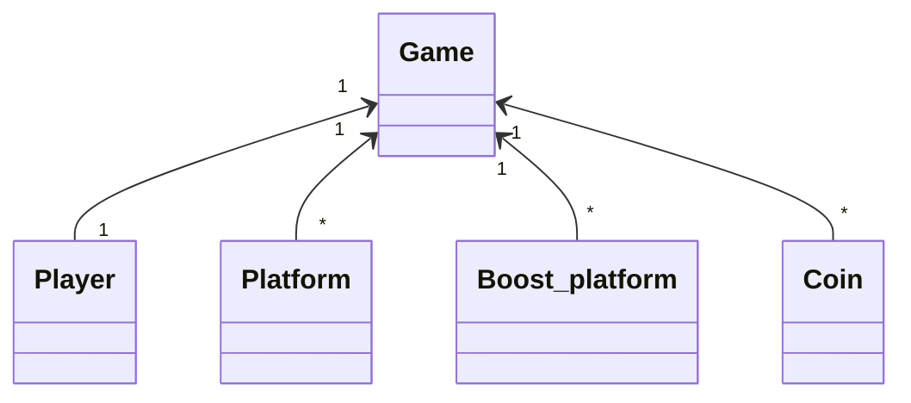

# Arkkitehtuurikuvaus

## Luokkarakenne

## Tietojen tallennus

Pelin parhaat tulokset eli highscore ja most coins tallennetaan omiin tiedostoihinsa. Nämä tiedot haetaan tiedostoista startmenu- ja gameover-näkymiin.

## Ohjelman rakenteen heikkoudet

Sovelluslogiikka ja käyttöliittymää ei ole eriytetty.
