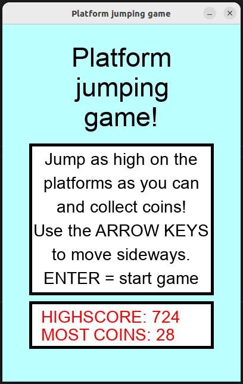
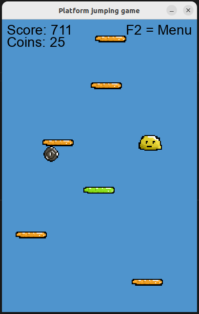
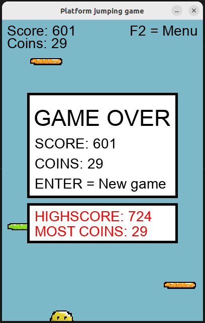

# Käyttöohje

Voit ladata viimeisimmän releasen lähdekoodin täältä valitsemalla Assets-osion alta Source code.

## Käynnistäminen


1. Asenna riippuvuudet komennolla:

```poetry install```

2. Käynnistä sovellus komennolla:

```poetry run invoke start```

## Käyttö

Sovellus käynnistyy pelin aloitusnäkymään:



Aloitusnäkymässä on ohjeet pelin pelaamiseen ja uuden pelin aloittamiseen.
Pelissä liikutaan sivusuunnassa nuolinäppäimillä (eli nuoli vasemmalle ja nuoli oikealle) ja uusi peli aloitetaan painamalla enteriä.

Pelinäkymä:



Pelin aikana ylälaidassa näkyy reaaliaikaisesti pisteet ja kerätyt kolikot sekä ohje aloitusnäkymään(menu) palaamiseen.
Yritä päästä tasoja pitkin hyppien mahdollisimman korkealle putoamatta ja kerää samalla kolikoita.

Gameover-näkymä:



Kun pelihahmo putoaa, tulee näkyviin gameover-näkymä, jossa näet pelin tulokset, parhaat tuloksesi ja ohjeen uuden pelin aloittamiseen(enter).

Pelin aikana ja gameover-näkymässä ollessa takaisin aloitusnäkymään pääsee painamalla F2-näppäintä.
